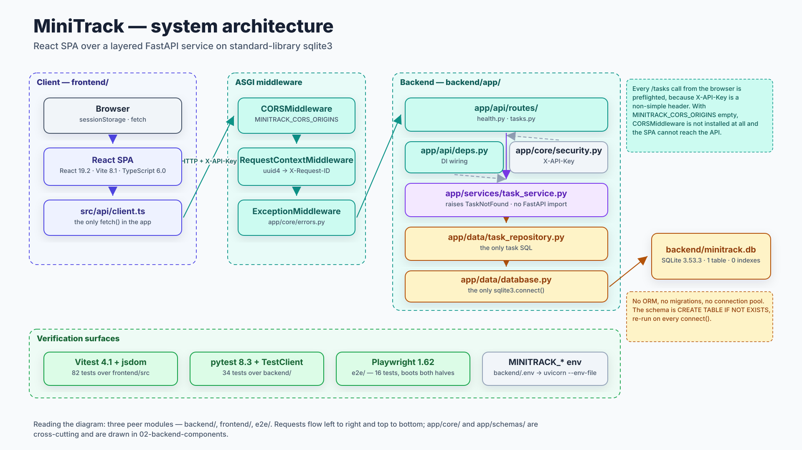
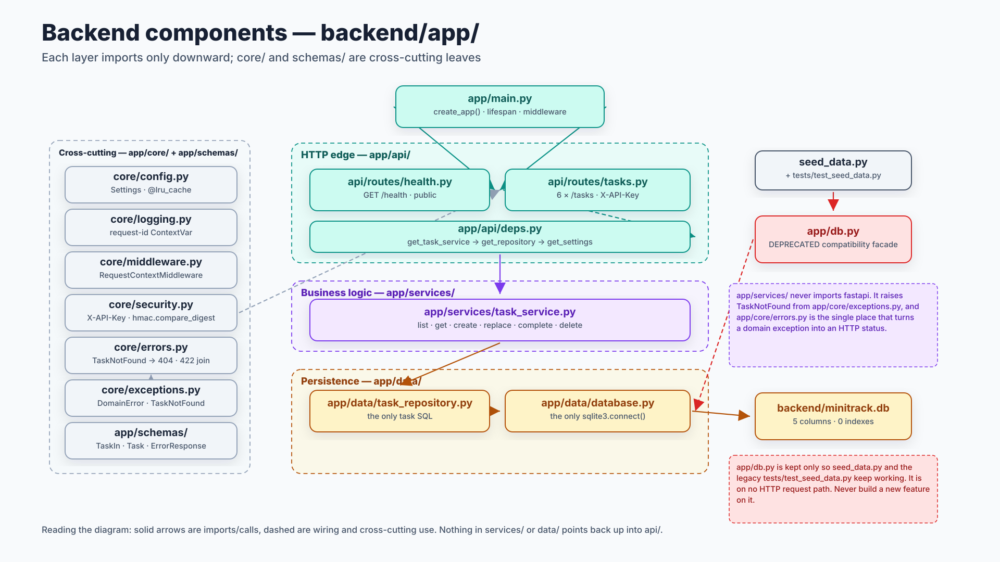
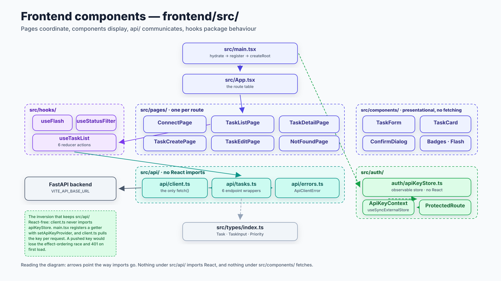
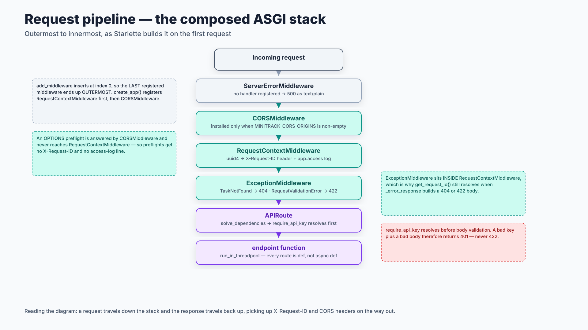

# Architecture and component diagrams

Four structural views. Sources in [`drawio/`](drawio), rendered from
[specs.py](specs.py) — see [README.md](README.md) for the legend and how to
rebuild.

> **Paths are module-relative.** The repo is three peer modules — `backend/`,
> `frontend/`, `e2e/` — and each diagram writes paths relative to the module it
> describes. `app/data/database.py` means `backend/app/data/database.py`;
> `src/api/client.ts` means `frontend/src/api/client.ts`.

---

## System architecture

*Source: [01-system-architecture.drawio](drawio/01-system-architecture.drawio)*

**Reading the diagram.** A request travels left to right: the browser calls into
the SPA, `src/api/client.ts` is the only place a `fetch` is issued, and it
crosses the network into the ASGI middleware stack before reaching `app/`. Inside
`app/`, control moves top to bottom through the three layers — routes, service,
repository — and only `app/data/database.py` opens a connection to
`minitrack.db`.

Two things worth internalising:

- **Every `/tasks` call from the browser is preflighted**, because `X-API-Key` is
  a non-simple header. If `MINITRACK_CORS_ORIGINS` is empty, `CORSMiddleware` is
  not installed *at all* and the SPA cannot reach the API — a confusing failure
  because `curl` still works fine.
- The three **verification surfaces** test different things: Vitest exercises the
  SPA against a stubbed `fetch`, pytest exercises `app/` through `TestClient`,
  and only Playwright runs both halves against each other for real.

`app/core/` and `app/schemas/` are cross-cutting and are drawn in the next
diagram rather than cluttering this one.

---

## Backend components

*Source: [02-backend-components.drawio](drawio/02-backend-components.drawio)*

**Reading the diagram.** Solid arrows are imports and calls; dashed arrows are
wiring and cross-cutting use. The rule the layout encodes is that **nothing in
`services/` or `data/` points back up into `api/`**:

- `app/api/` knows about HTTP and nothing about SQL.
- `app/services/task_service.py` never imports `fastapi`. It raises
  `TaskNotFound` from the framework-free `app/core/exceptions.py`, and
  `app/core/errors.py` is the single place a domain exception becomes a status
  code. That split is what lets the service layer be unit-tested against a fake
  repository with no app instance at all.
- `app/data/task_repository.py` is the only module issuing task SQL, and
  `app/data/database.py` is the only one calling `sqlite3.connect()`.

`app/db.py` is drawn detached and in red on purpose: it is a deprecated facade
kept only so `seed_data.py` and the legacy `tests/test_seed_data.py` keep
working. It sits on no HTTP request path. Never build a new feature on it.

This is the fuller version of the ASCII layer diagram in
[ARCHITECTURE.md §3](../../ARCHITECTURE.md) and agrees with it.

---

## Frontend components

*Source: [03-frontend-components.drawio](drawio/03-frontend-components.drawio)*

**Reading the diagram.** Arrows point the way imports go. The frontend mirrors
the backend's layering: pages coordinate a whole screen, components display,
`src/api/` communicates, `src/hooks/` packages reusable stateful behaviour, and
`src/types/` is a leaf that imports nothing.

The one non-obvious edge is the dashed line from `src/main.tsx` to
`auth/apiKeyStore.ts`. **`client.ts` never imports the store.** `main.tsx`
registers a getter via `setApiKeyProvider`, and `client.ts` *pulls* the key at
request time. That inversion is what keeps `src/api/` free of React imports —
and a pushed key would lose the effect-ordering race (React runs child effects
before parent effects) and 401 on first load.

`src/auth/` is drawn as a side branch for the same reason: it is reachable from
components through context and from the API layer only through a registered
function.

---

## Request pipeline

*Source: [04-request-pipeline.drawio](drawio/04-request-pipeline.drawio)*

**Reading the diagram.** This is the stack Starlette composes on the first
request, outermost at the top. A request travels down and the response travels
back up, picking up `X-Request-ID` and CORS headers on the way out.

The ordering is the part that surprises people. `add_middleware` **inserts at
index 0**, so the *last* middleware registered ends up *outermost*. `create_app()`
registers `RequestContextMiddleware` first and `CORSMiddleware` second, which is
why CORS wraps the request-id layer. Three consequences:

- An `OPTIONS` preflight is answered by `CORSMiddleware` and never reaches
  `RequestContextMiddleware` — preflights get **no** `X-Request-ID` and **no**
  access-log line. If you are counting requests in the log, browser traffic
  appears halved.
- `ExceptionMiddleware` sits *inside* `RequestContextMiddleware`, which is why
  `get_request_id()` still resolves when `_error_response` builds a 404 or 422
  body. That is not luck; move the registration and the `request_id` field goes
  null.
- `require_api_key` is a router-level dependency and resolves **before** body
  validation, so a request with both a bad key and a bad body returns **401,
  never 422**.

See [flows.md §3](flows.md#3-how-an-error-becomes-a-response) for what each
exception type turns into, and
[17-seq-validation-422](sequences.md#a-validation-failure-becomes-a-single-string)
for the 422 path end to end.
