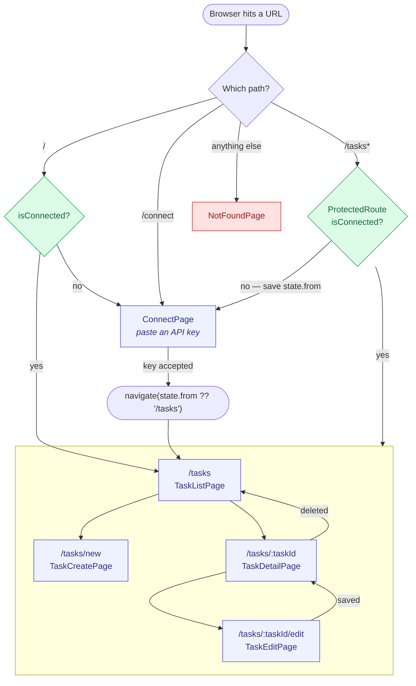
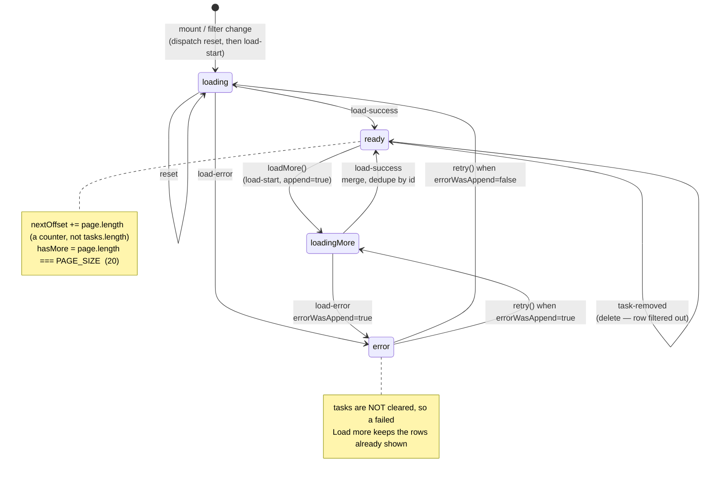
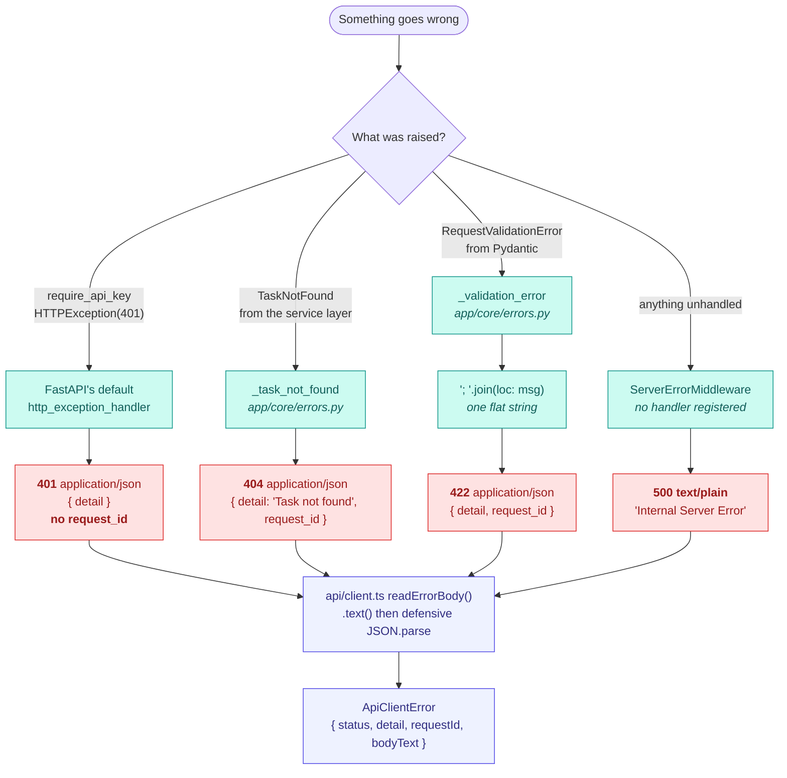
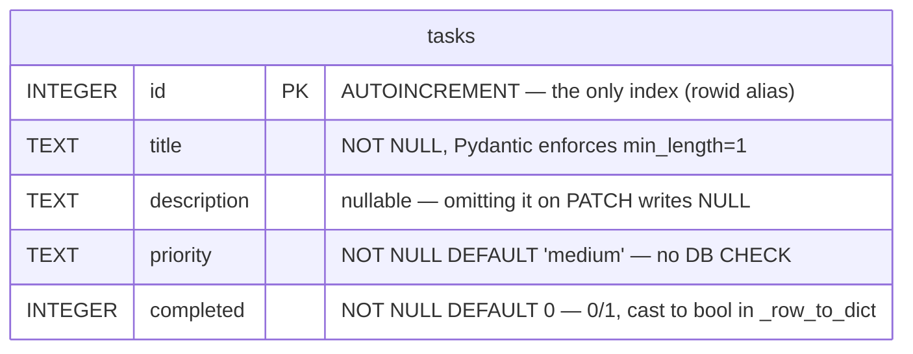

# Flowcharts

Four Mermaid diagrams covering routing, state, error mapping and the data model.
These are inline fenced blocks rather than generated files — GitHub renders them
directly, so they need no build step and stay diffable.

Component and sequence diagrams live in [architecture.md](architecture.md) and
[sequences.md](sequences.md); those are Draw.io, built by
[build_diagrams.py](build_diagrams.py).

---

## 1. Routes and the connection guard

Every `/tasks*` route sits behind `ProtectedRoute`, which redirects to `/connect`
and remembers where you were headed in `state.from`. `/` is a pure redirect that
branches on connection state, so a reload never flashes the wrong screen.

A mid-session 401 disconnects the store, which flips `isConnected` to false and
makes `ProtectedRoute` redirect declaratively — no imperative navigation from the
error handler. See [16-seq-session-401](sequences.md#a-mid-session-401-tears-the-session-down).

---

## 2. `useTaskList` state

The hook is a `useReducer` with six action types. `tasks` deliberately survives a
`load-error`, so a failed *Load more* leaves the rows you already have on screen
with a retry affordance rather than blanking the list.

Two guards protect this machine from out-of-order responses: an `AbortController`
cancels the in-flight page, and a monotonic `requestSeq` makes a late reply that
survives the abort get dropped instead of overwriting newer state.

---

## 3. How an error becomes a response

Three different shapes come out of this app, and the frontend has to read all
three. This is why error bodies are always read with `.text()` and parsed
defensively — never `.json()`.

Ordering trap: `require_api_key` is a router-level dependency, so it resolves
**before** body validation. A request with both a bad key and a bad body returns
**401, never 422**.

---

## 4. Data model

One table, five columns, created by `CREATE TABLE IF NOT EXISTS` in
`app/data/database.py` and re-run on every `connect()`.

Three things this schema does **not** have, all easy to assume into existence:

| Assumption | Reality |
|---|---|
| An index on `completed` or `priority` | **None.** `PRAGMA index_list(tasks)` is empty. The `completed` filter is a full scan. |
| A migration system | **None.** No Alembic, no `migrations/`, and `PRAGMA user_version` is `0` with nothing reading it. |
| A `CHECK` constraint on `priority` | **None.** `low\|medium\|high` is enforced only by the `Priority` enum in `app/schemas/task.py`. Raw SQL can write anything. |

There are no foreign keys because there is exactly one table — no users, no
assignees, no tags, no comments, no subtasks. Adding a column means changing the
DDL *and* `TaskIn`/`Task` in `app/schemas/task.py` *and* `_row_to_dict`, since the
repository builds its dicts field by field rather than splatting the row.
