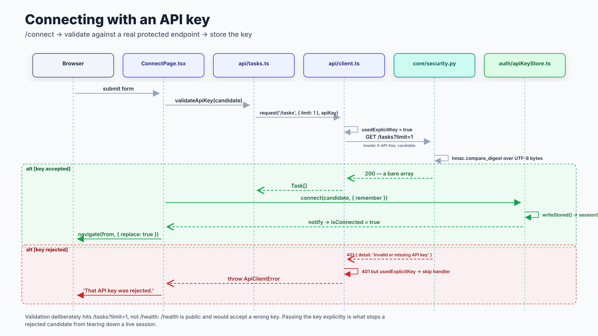
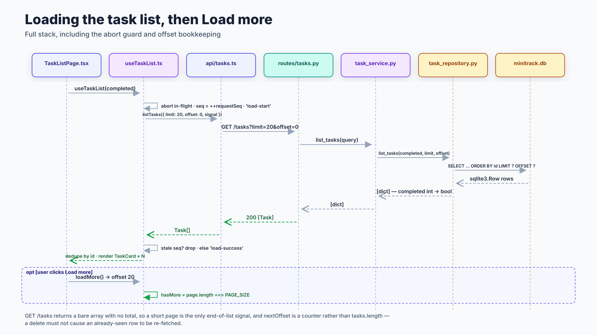
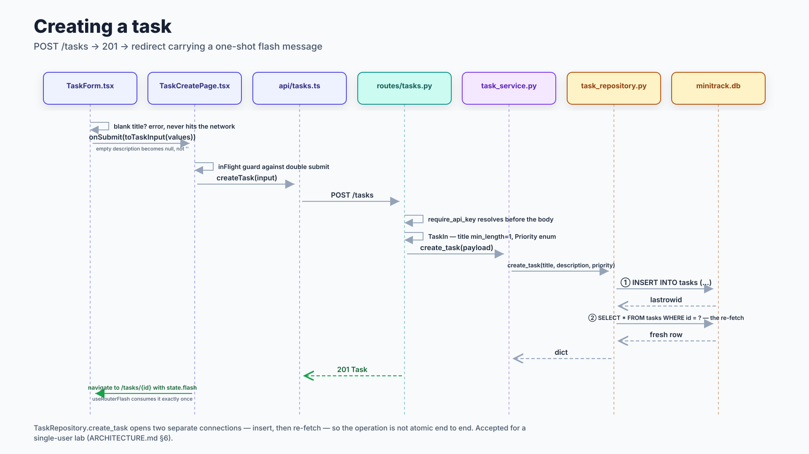
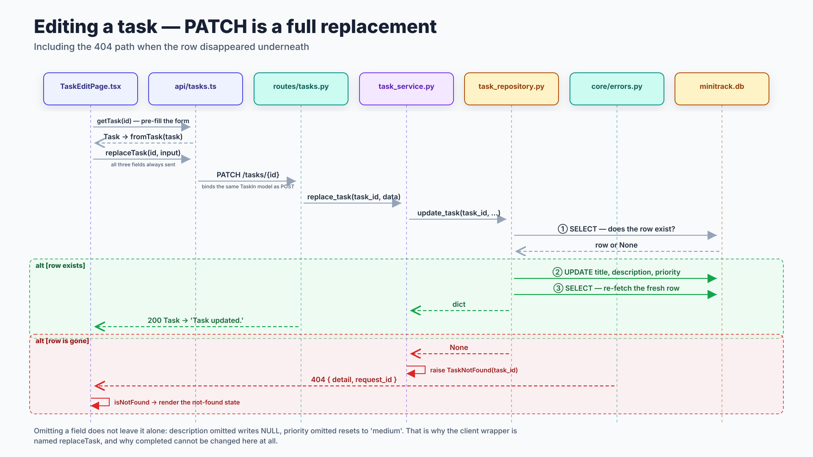
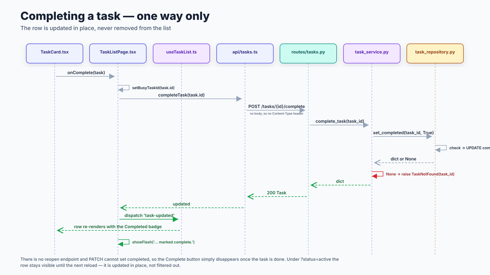
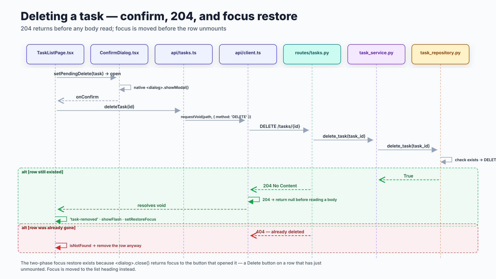
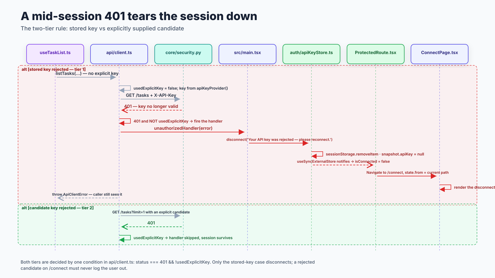
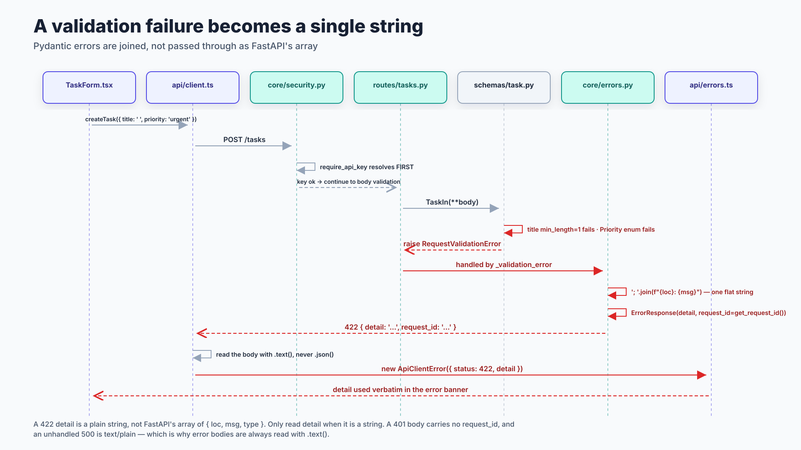

# Sequence diagrams

Eight flows, each end to end — browser through React through HTTP through the
service and repository layers to SQLite, and back. Sources in
[`drawio/`](drawio), rendered from [specs.py](specs.py); see
[README.md](README.md) for the legend.

Solid arrows are calls, dashed arrows are returns, dashed bands are `alt` / `opt`
fragments. Green is the success path, red the failure path.

- [Connecting with an API key](#connecting-with-an-api-key)
- [Loading the task list, then Load more](#loading-the-task-list-then-load-more)
- [Creating a task](#creating-a-task)
- [Editing a task — PATCH is a full replacement](#editing-a-task--patch-is-a-full-replacement)
- [Completing a task — one way only](#completing-a-task--one-way-only)
- [Deleting a task — confirm, 204, and focus restore](#deleting-a-task--confirm-204-and-focus-restore)
- [A mid-session 401 tears the session down](#a-mid-session-401-tears-the-session-down)
- [A validation failure becomes a single string](#a-validation-failure-becomes-a-single-string)

---

## Connecting with an API key

*Source: [10-seq-connect.drawio](drawio/10-seq-connect.drawio)*

There are no accounts in MiniTrack — you connect with a key rather than signing
in. Two deliberate choices show up here:

- Validation hits **`/tasks?limit=1`, not `/health`**. `/health` is public and
  would happily accept a wrong key, so it proves nothing.
- The candidate key is passed **explicitly** rather than being stored first and
  read back. That sets `usedExplicitKey`, which suppresses the global 401
  handler — so a rejected candidate typed on `/connect` cannot tear down a
  session that is already working. See
  [the 401 diagram](#a-mid-session-401-tears-the-session-down) for the other tier.

The key is held in memory and only written to `sessionStorage` if the user opts
in on the form.

---

## Loading the task list, then Load more

*Source: [11-seq-task-list.drawio](drawio/11-seq-task-list.drawio)*

The full stack version of what the older frontend-only diagram showed as a single
hop. Three details carry weight:

- **`GET /tasks` returns a bare array with no total.** A short page is the only
  end-of-list signal, which is why pagination is "Load more" rather than numbered
  pages and why `hasMore` is `page.length === PAGE_SIZE`.
- **`nextOffset` is a counter**, incremented by the raw page length rather than
  derived from `tasks.length`. Deriving it would make a delete cause an
  already-seen row to be re-fetched.
- Two guards handle out-of-order responses: an `AbortController` cancels the
  in-flight page, and a monotonic `requestSeq` drops a late reply that survived
  the abort. Without the second guard, a slow first page can overwrite a fast
  second one.

`completed` is a full table scan — there is no index. Fine at lab scale, worth
knowing before anyone assumes otherwise.

---

## Creating a task

*Source: [12-seq-create-task.drawio](drawio/12-seq-create-task.drawio)*

Validation happens twice on purpose: `TaskForm` blocks a blank title client-side
so the network is never touched, and `TaskIn` enforces it server-side so the API
is safe regardless of client. `toTaskInput` maps an empty description to `null`
rather than `""`.

Note the repository opens **two** connections — insert, then re-fetch — so the
operation is not atomic end to end. That is an accepted trade for a single-user
lab; see [ARCHITECTURE.md §6](../../ARCHITECTURE.md).

The redirect carries the flash message in router state, and `useRouterFlash`
consumes it exactly once, so a refresh or a Back navigation cannot replay
"Task created."

---

## Editing a task — PATCH is a full replacement

*Source: [13-seq-edit-task.drawio](drawio/13-seq-edit-task.drawio)*

**The single most misleading endpoint in the API.** `PATCH /tasks/{id}` binds the
same `TaskIn` model as `POST`, so it replaces rather than merges:

| You omit | You get |
|---|---|
| `description` | `NULL` — the old text is gone |
| `priority` | `"medium"` — reset, not preserved |
| `completed` | not settable at all; PATCH cannot reopen a task |

That is why the client wrapper is named `replaceTask` and why `toTaskInput`
always emits all three fields.

The red branch shows where a 404 comes from: the repository returns `None`, the
*service* raises `TaskNotFound`, and `app/core/errors.py` maps it. The router
contains zero error-handling logic. Note the repository opens **three**
connections for one logical update — check, mutate, re-fetch.

---

## Completing a task — one way only

*Source: [14-seq-complete-task.drawio](drawio/14-seq-complete-task.drawio)*

There is no reopen endpoint, and PATCH cannot set `completed`. The Complete
button simply stops rendering once the task is done — **do not add a Reopen
button**; `TaskInput` types `completed` as `never` to make that a compile error.

The row is updated **in place**, not removed. Under `?status=active` a
just-completed task stays visible until the next reload. That is intentional:
having a row vanish under the cursor the instant you click is worse.

---

## Deleting a task — confirm, 204, and focus restore

*Source: [15-seq-delete-task.drawio](drawio/15-seq-delete-task.drawio)*

`ConfirmDialog` uses the native `<dialog>` element, so the focus trap and Escape
handling come from the browser rather than being reimplemented.

Two subtleties:

- **204 returns before any body is read.** `requestVoid` short-circuits on
  204/205, because calling `.json()` on an empty body throws.
- The **two-phase focus restore** exists because `<dialog>.close()` returns focus
  to the element that opened it — a Delete button on a row that has just
  unmounted. Focus is moved to the list heading instead, so keyboard and screen
  reader users are not dumped at the top of the document.

The red branch handles the already-deleted case: a 404 still removes the row
locally, because the user's intent was satisfied either way.

---

## A mid-session 401 tears the session down

*Source: [16-seq-session-401.drawio](drawio/16-seq-session-401.drawio)*

Both tiers are decided by **one condition** in `api/client.ts`:
`status === 401 && !usedExplicitKey`.

| Tier | When | Result |
|---|---|---|
| 1 — stored key rejected | key came from the registered provider | disconnect, clear `sessionStorage`, redirect to `/connect` with a reason |
| 2 — candidate key rejected | key was passed explicitly (only `validateApiKey`) | handler skipped; the error is thrown to the caller and the session survives |

The redirect is **declarative**, not imperative: the handler only disconnects the
store, `useSyncExternalStore` re-renders, `isConnected` flips false, and
`ProtectedRoute` does the navigating. `state.from` records where the user was, so
reconnecting returns them there.

---

## A validation failure becomes a single string

*Source: [17-seq-validation-422.drawio](drawio/17-seq-validation-422.drawio)*

MiniTrack overrides FastAPI's default validation handler. A 422 `detail` is a
**plain string** — Pydantic's errors joined with `"; "` — not the array of
`{loc, msg, type}` you would get from stock FastAPI. Client code must only read
`detail` when it is a string.

Two neighbours worth holding alongside it:

- A **401 body has no `request_id`** (404 and 422 do), because it comes from
  FastAPI's built-in handler rather than `app/core/errors.py`.
- An **unhandled 500 is `text/plain`**, not JSON.

Three shapes, so error bodies are always read with `.text()` and parsed
defensively — never `.json()`. The mapping is summarised in
[flows.md §3](flows.md#3-how-an-error-becomes-a-response).

Ordering trap, visible at the top of the diagram: `require_api_key` resolves
before body validation, so a bad key plus a bad body returns **401, never 422**.
